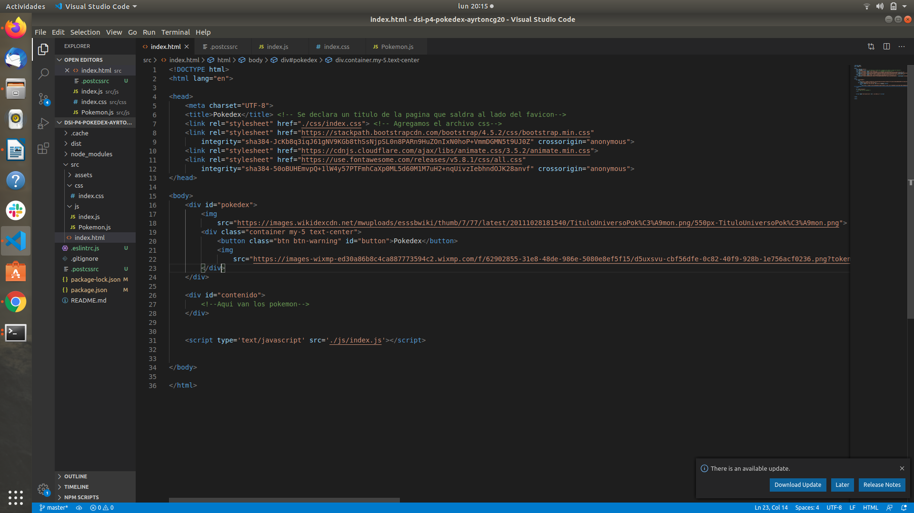
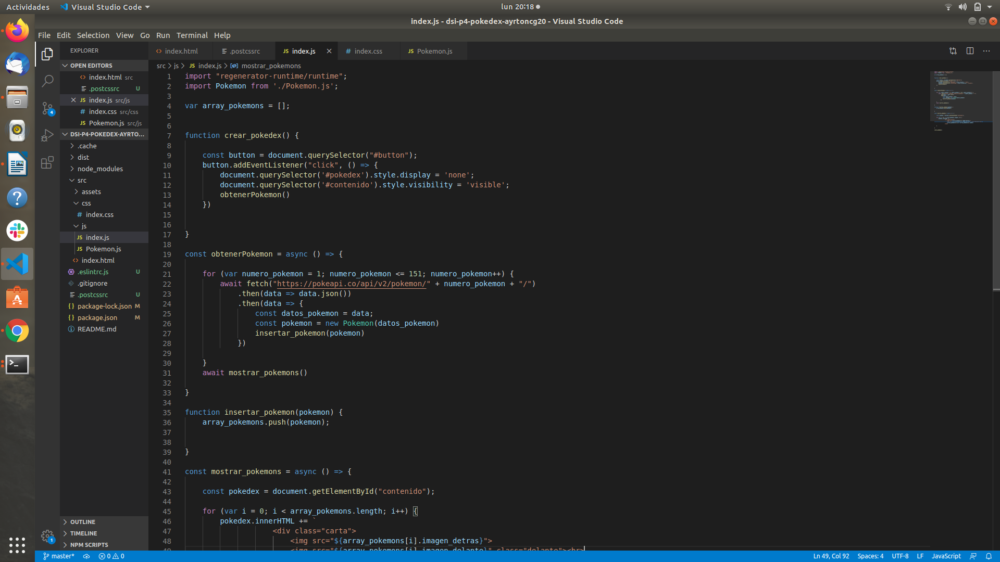
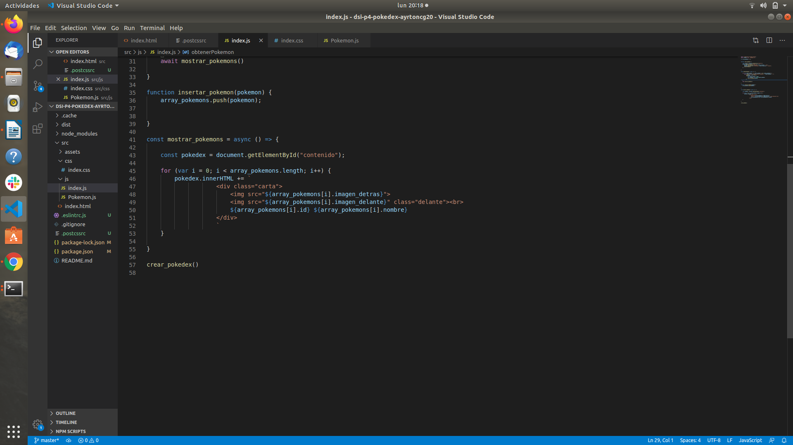
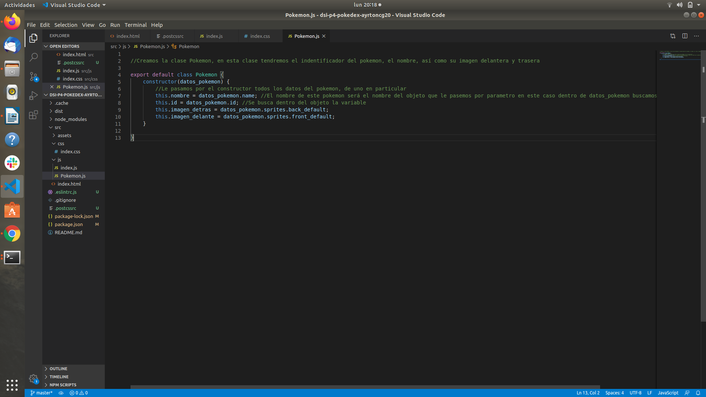
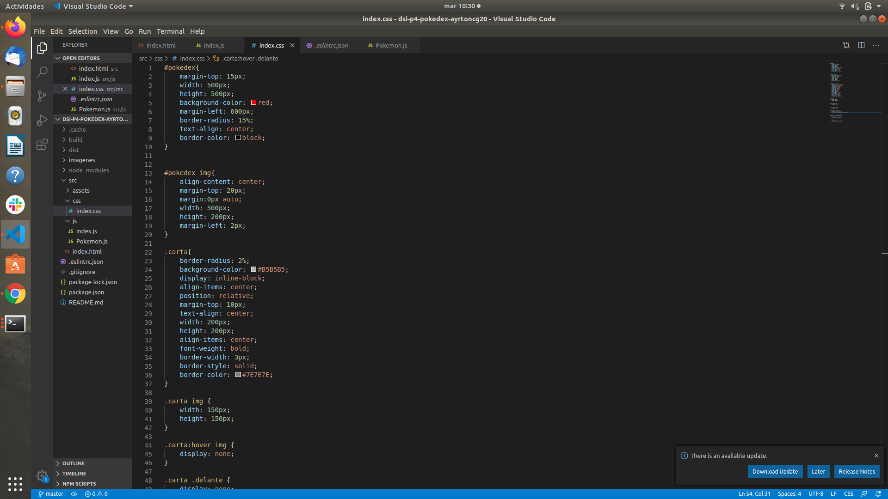
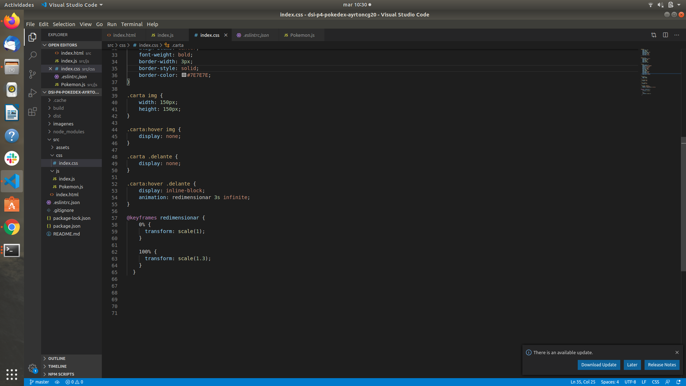

### Práctica 4: Pokedex

# Práctica

Necesitamos crear una PokeDex para mostrar un listado de los 151 pokémon de primera generación. Para ello, podemos utilizar la API gratuita PokeAPI. Dicho servicio pone a nuestra disposición una API que al realizar la petición https://pokeapi.co/api/v2/pokemon/1/ nos muestra información del pokémon número 1, que entre otras cosas que puedes profundizar en su documentación, nos devuelve un JSON con la siguiente información:

```
{
   abilities: [],     // Array de objetos con las habilidades del pokémon
   height: Integer,   // Altura del pokémon
   weigth: Integer,   // Peso del pokémon
   id: Integer,       // Número del pokémon en la pokedex
   moves: [],         // Movimientos del pokémon
   sprites: {},       // Imágenes del pokémon (frontal, trasera, shiny, etc...)
   stats: [],         // Estadísticas del pokémon
   types: [],         // Tipos del pokémon
   ...
}
```

Nuestro objetivo es realizar lo siguiente:

- Crea una página donde se muestren todos los pokémon de la primera generación en un elemento HTML, donde en su interior aparezca la imagen del mismo, su ID y su nombre. Utiliza PostCSS para darle estilos y adaptarlos para que parezca una tarjeta o carta.

- Modifica el ejemplo de modo que todos los pokemon se vean de espaldas y cuando pases el ratón por encima de ellos, se muestren de frente. ¿Serías capaz también de conseguir aumentar su tamaño mediante CSS? ¿Que propiedad tendrías que utilizar? ¿Encuentras alguna forma de mantener el pixelado de la imagen sin que se vea borrosa?

- La forma más fácil de hacer los puntos anteriores es utilizar los recursos de forma local o teniendo un JSON en local con toda la información. Sin embargo, la idea de esta práctica es obtener la información desde la API de PokéAPI realizando peticiones desde Javascript y obteniendo la información necesaria. Asegúrate que lo estás haciendo así y comprueba que el orden de los pokémon es el correcto (ordenados, de menor a mayor). Pista: Las promesas y Promise.all() podría ayudarte.

NOTA: Ten en cuenta que la API de PokéAPI tiene un límite de 100 peticiones por IP al minuto (sin incluir las imágenes). Este es un caso didáctico para aprender a trabajar con promesas. Un buen criterio en el caso de que querer hacer algo real para poner en producción, podría ser almacenar la información en el localStorage del navegador (o en una base de datos en backend) y extraer los datos de allí, para no sobrepasar el límite de la API. De esta forma estaríamos usando esa capa como caché y las obtenemos de ahí si ya existen, evitando volver a hacer peticiones innecesarias.

Criterios importantes

- Mostrar cartas visuales con información
- Cambio visual del sprite (imagen) de espaldas al sprite de frente
- Obtención de información mediante la API PokéAPI
- ¿Los pokémon salen siempre en orden creciente?
- Mejoras o funcionalidades extra

Retos

- Busca plugins de PostCSS que consideres interesantes y documentalos en el README.md con un enlace a su GitHub y una breve descripción de lo que hacen y para que podría serte útil.
- Digital Clock: Reto fácil. Implementa un reloj digital que muestre la hora actual. Para conseguir el relleno izquierdo de los ceros, investiga el método .padStart().
- Analogic Clock: Reto difícil. Implementa un reloj analógico que muestre la hora real · Previsualización

### Comenzando 

Antes que nada para poder comenzar la práctica lo primero que tenemos que hacer al crear el directorio de trabajo es hacer un:

```
$ npm init
```
Para iniciar un repositorio. Dentro de la carpeta tenemos que hacer:

```
$ git remote add origin <ruta_ssh>
```

A continuación creamos el package.json

```
$ npm init -y 
```

Por último instalamos parcel de manera local:

```
$ npm install -D parcel-bundler
```

Lo primero que tenemos que hacer es crear la jerarquía de la práctica, para ello creamos todos los directorios. 

```
src
  assets
  css
   index.css
  js
   index.js
   Pokemon.js
  index.html
```

Comenzamos con el código y nos dirigimos al index.html para explicarlo:

En este fichero creamos una primpera parte para mostrar una especie de pokedex con la que podemos interactuar para después ver la lista de pokemon que tiene esa pokedex. Para ello declaramos un div pokedex donde tenemos unas imagenes y un boton el cual el usuario va a pulsar para ver todos los pokemon que hay. 

```
 <div id="pokedex">
        <!--Creamos un div para tener una especie de pokedex donde tendremos un boton para poder ver todos los pokemon-->
        
        <div class="container my-5 text-center">
            <button class="btn btn-warning" id="button">Pokedex</button>
            
        </div>
    </div>
 ```
 Después he declarado un div contenido que es donde vamos a añadir todos nuestros pokemons con javascript.
 
 En la siguiente imagen podemos ver el index.html


Ahora nos dirigimos al index.js.

Dentro del index.js tenemos que declarar:

```
import 'regenerator-runtime/runtime'
import Pokemon from './Pokemon.js
```

Declaramos runtime para que las promesas no fallen y tambien tenemos que importar la clase pokemon para poder crear objetos tipo pokemos mas adelante.

```
var array_pokemons = []
```

Creamos un array de pokemon, contendrá todos los pokemon de la pokedex. 

Comenzamos ahora con las funciones, la primera función que nos encontramos en la de crear pokedex:

```
function crear_pokedex () { // Cremos una funcion crear pokedex que se encargara de cuando toquemos el boton quitar la pokedex y mostrar los pokemon
  const button = document.querySelector('#button') // Seleccionamos el elemento boton
  button.addEventListener('click', () => { // Si hay un evento de click
    document.querySelector('#pokedex').style.display = 'none' // La pokedex ponla a nula
    document.querySelector('#contenido').style.visibility = 'visible' // Pon el contenido a visible
    obtenerPokemon() // Llamamos a la función obtener pokemon
  })
}
```

En esta función utilizamos javascript para coger el boton creado en el html, creamos una constante llamada button. Le añadimos un evento click a esa constante, cuando el usuario haga click en el boton entonces, la pokedex se dejará de ver y se empezará a ver el contenido de la pokedex que son los pokemons, por último dentro de esta función llamamos a obtenerPokemon().

A continuación vamos a ver la función obtener pokemon:

```
const obtenerPokemon = async () => { // Tenemos que utilizar promesas por lo que declaramos un async
  for (var numero_pokemon = 1; numero_pokemon <= 151; numero_pokemon++) { // Recorremos el numero de pokemon que tenemos
    await fetch('https://pokeapi.co/api/v2/pokemon/' + numero_pokemon + '/') // Hacemos una promesa para que nos devuelva cada pokemon
      .then(data => data.json()) // Guardamos en data el json de los datos del pokemon
      .then(data => {
        const datos_pokemon = data // Guardamos en datos pokemon el json de los datos del pokemon guardado en data gracias a las promesas
        const pokemon = new Pokemon(datos_pokemon) // Creamos un nuevo pokemon con los datos del mismo
        insertar_pokemon(pokemon) // Llamamos a insertar pokemon que se encargara de insertar los pokemon en el array
      })
  }
  await mostrar_pokemons() // Esperamos y cuando se haya realizado todo llamamos a la funcion mostrar pokemon
}
```

Dentro de esta función utilizamos las promesas, por ello declaramos la función como asíncrona. Declaramos un for para poder llamar a todos los pokemon con la promesa fetch y la url mas el numero del pokemon. Dentro de la promesa el json del pokemon se guarda en data por lo que nosotros hemos creado una constante llamada datos_pokemon donde guardamos el json del pokemon. A continuacion creamos un objeto tipo pokemon y le pasamos la constante datos pokemon. Vamos a ver que tiene la clase Pokemon:

```

export default class Pokemon {
  constructor (datos_pokemon) {
    // Le pasamos por el constructor todos los datos del pokemon, de uno en particular
    this.nombre = datos_pokemon.name // El nombre de este pokemon será el nombre del objeto que le pasemos por parametro en este caso dentro de datos_pokemon buscamos la variable name
    this.id = datos_pokemon.id // Se busca dentro del objeto la variable id
    this.imagen_detras = datos_pokemon.sprites.back_default // Guardamos la imagen de detras
    this.imagen_delante = datos_pokemon.sprites.front_default // guardamos la imagen de delante
  }
}
```
Dentro de la clase pokemon tenemos un constructor que recibe los datos del pokemon por paramentro y una serie de propiedades, el id, el nombre, la imagen delantera y la imagen trasera, los datos necesarios de cada pokemon. 


Lo siguiente fue meternos con el javascript, con el archivo index.js, este archivo va a tener las funciones. Lo primero que tuve que hacer fue obtener el evento del click en el boton de la pokedex por lo que cree una funciona donde hicieramos esto y la pokedex la ocultamos y mostramos los pokemon, también llamamos a la funcion obtener pokemon. 
En la función obtener pokemos hacemos uso de las promesas para obtener los objetos de los pokemons de la API proporcionada, guardamos los datos en un json lo que lo pasamos a una constante y luego creamos un nuevo objeto pokemon con los datos del pokemon, en este caso, el id, el nombre, la imagen delantera y la imagen trasera, y estos pokemon al ir creando objeto por objeto los tenemos que guardar en algun sitio para luego poder mostrarlos por pantalla para ello llamamos a la funcion insertar pokemon que inserta cada objeto de cada pokemon en un array de pokemon que tenemos hecho al principio. Cuando todo esto haya acabado llamamos a la funcion mostrar pokemon que se encargara de mostrar en la pagina web todos los pokemons en lista ascendente. En la siguiente imagen podemos observar el código:



En la siguiente imagen podemos observar el codigo de mostrar los pokemons, lo que hacemos es buscar el elemento que se llame contenido que es donde van a estar los pokemon y guardarlo en una constante que luego utilizaremos. 
Creamos un for del tamaño del array que en este caso sera de 151, y para cada posición creamos un div carta con dos imagenes, por lo que vamos a tener el id el nombre y las dos imagenes, la trasera y la delantera. 



Creamos una clase pokemon para poder hacer objetos de tipo pokemon que tuviera el nombre, el id, y las imagenes correspondientes a cada pokemon. 



Aquí tenemos los estilos dados a cada uno de los div o de las clases o las propias imagenes. Como se puede ver un poco en la primera imagen, hemos hecho uso de :hover para que cuando nosotros pasemos el raton por encima de la imagen del pokemon se nos ponga la otra, tambien hemos hecho uso de display: inline-block y display: none para poder quitarlas y ponerlas cuando nosotros dejemos de pasar con el raton por encima. 



Para redimensionar la imagen solo hemos tenido que hacer uso de animation y de un keyframes llamado redimensionar donde le transformamos la escala a la imagen. 



### ¿Qué es PostCss?

Es “una herramienta para transformar CSS con plugins de Javascript”

### RETOS

1. Busca plugins de PostCSS que consideres interesantes y documentalos en el README.md con un enlace a su GitHub y una breve descripción de lo que hacen y para que podría serte útil.

# CSSNext

CSS Next te permite usar la sintaxis más actualizada de CSS en sitios web que estás desarrollando. Como debes saber la W3C, comunidad encargada de regular los estándares usados en la web, publica nuevas reglas para CSS que permiten a los desarrolladores agilizar su proceso de trabajo. Sin embargo, estas nuevas reglas todavía no han sido implementadas en las últimas versiones de los navegadores más populares. Es aquí cuando CSS Next entra en acción y te permite hacer uso de esta nueva sintaxis sin comprometer el funcionamiento de tus sitios.


URL Github Pages: https://ull-esit-dsi-1920.github.io/dsi-p4-pokedex-ayrtoncg20/


